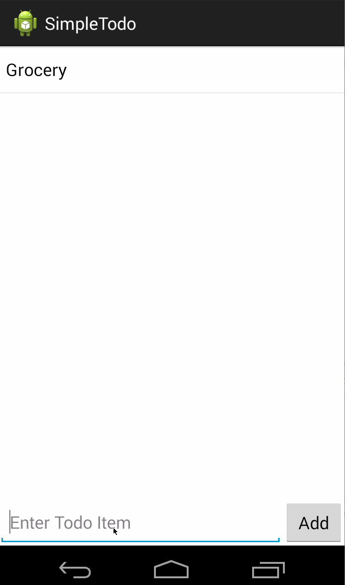

# Simple ToDo app

This is an Android demo application for creating and managing a simple ToDo list.

Time spent: 3 hours spent in total

Completed user stories:

 * [x] Required: User can view list of ToDo items
 * [x] Required: User can add a new ToDo item
 * [x] Required: User can delete an existing ToDo item

Walkthrough of all user stories:

GIF created with [LiceCap](http://www.cockos.com/licecap/).

