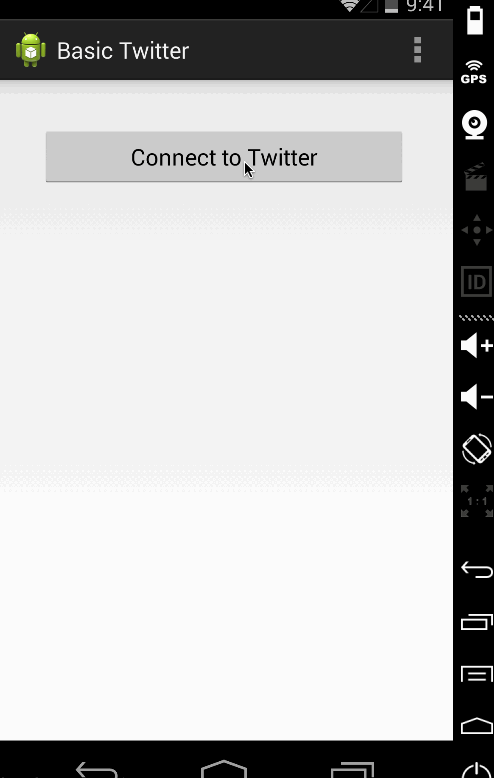

# Basic Twitter app

This is an Android demo application for Baic twitter App

Time spent: 9 hours spent in total

Completed user stories:

* [x] Required: User can sign in using OAuth login flow
* [x] Required: User can view last 25 tweets from their home timeline
* [x] Required:  User should be able to see the user, body and timestamp for tweet
* [x] Required: User should be displayed the relative timestamp for a tweet "8m", "7h"
* [x] Required: User can load more tweets once they reach the bottom of the list using "infinite scroll" pagination
* [x] Required: User can compose a new tweet
* [x] Required:  User can click a “Compose” icon in the Action Bar on the top right
* [x] Required:  User will have a Compose view opened
* [x] Required:  User can enter a message and hit a button to post to twitter
* [x] Required:  User should be taken back to home timeline with new tweet visible
* [x] Optional: User can see a counter with total number of characters left for tweet
* [x] Optional: Links in tweets are clickable and viewable
* [x] Optional: User can open the twitter app offline and see last loaded tweets
    Tweets are persisted into sqlite and can be displayed from the local DB

Walkthrough of all user stories:

GIF created with [LiceCap](http://www.cockos.com/licecap/).

