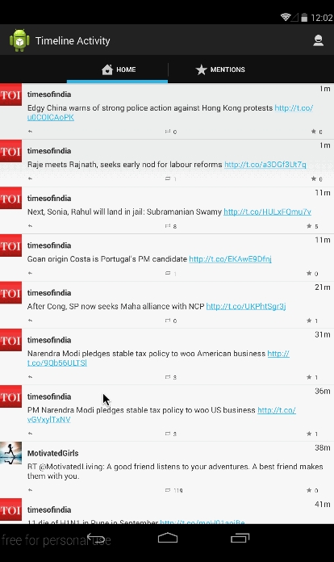

# Twitter With Fragments app

This is an Android demo application for twitter App

Time spent: 9 hours spent in total

Completed user stories:

* [Required] Includes all required user stories from Week 3 Twitter Client
* [Required] User can switch between Timeline and Mention views using tabs.
* [Required] User can view their home timeline tweets.
* [Required] User can view the recent mentions of their username.
* [Required] User can scroll to bottom of either of these lists and new tweets will load ("infinite scroll")
* [Required] User can navigate to view their own profile
* [Required] User can see picture, tagline, # of followers, # of following, and tweets on their profile.
* [Required] User can click on the profile image in any tweet to see another user's profile.
* [Required] User can see picture, tagline, # of followers, # of following, and tweets of clicked user.
* [Required] Profile view should include that user's timeline

Walkthrough of all user stories:

GIF created with [LiceCap](http://www.cockos.com/licecap/).

